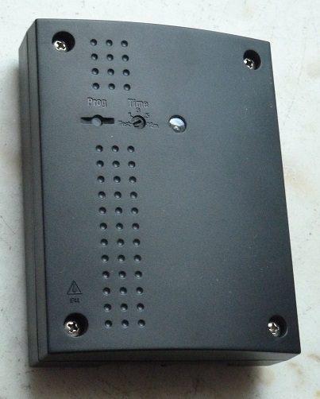
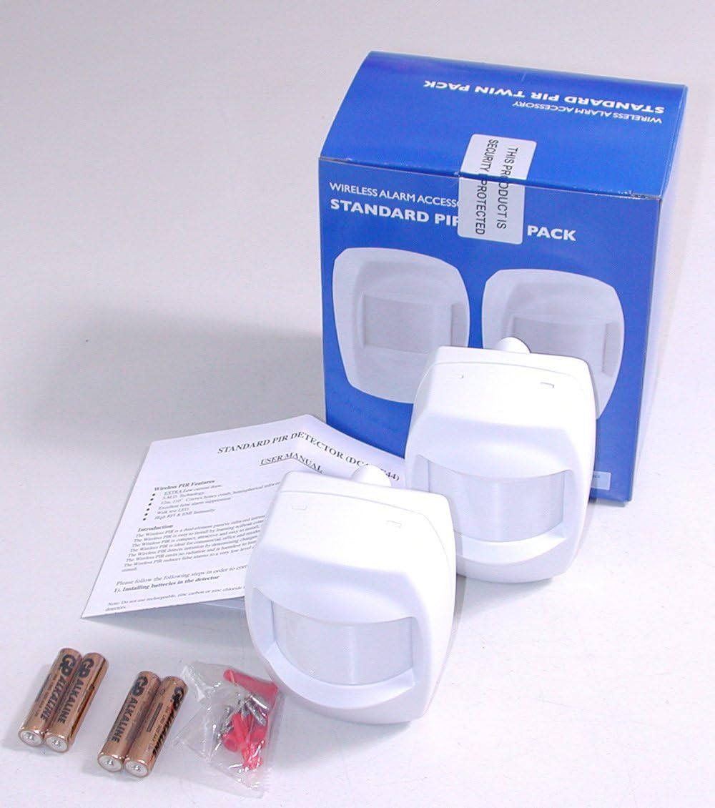
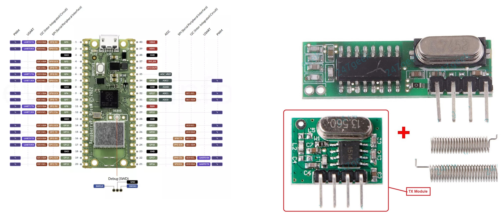

# IQ_Group_with_Friedland_PIR

The purpose of this repro is to enable a device to receive and recognise specific 433 MHz signals, and then transmit another specific 433 MHz signal that a IQ Group Receiver device can recognise.

Unfortunately, whilst the IQ Group receiver device can still be purchased, the necessary PIR sensor devices are no longer made. This repro enables other makes of Wireless PIR devices to be "paired" with the IQ Group Receiver.    

N.B. There are 2 programs in this repro at the moment. _(When I get time, I'll add the 3rd code for the "MQTT->TX" device)_
 - "RX->TX" device - This is for a combined 433 MHz RX and TX device as described above. Note that a PICO can be used for this. Whilst no WiFi is needed, both the RX and TX modules are used. 
 - "RX->MQTT" device - This is for a 433 MHz RX and MQTT sending (via WiFi network) device. Note that a PICO W is definately needed here and only the RX module is used. I used this version with the MQTT server in "Home assistant" (running on a separate Raspberry Pi server in my network) so I could easily see a log of MQTT triggering in the "Home Assistant" MQTT logs.

N.B. Consider that to get the IQ Group receiver to trigger with the 2nd program above ("RX->MQTT"), you would have to create an additional "MQTT->TX" device to complete the signal path (not described here yet). This additional "MQTT->TX" device would need to listen for a triggering MQTT signal from your WiFi network, and then transmit the required 433 MHz TX signal via a TX module to the IQ Group receiver. Whilst this approach is more complicated, the use of "RX->MQTT" device(s) and a "MQTT->TX" device with "Home Assistant" does open up more possiblities on how to control the IQ group Receiver e.g. Via voice processing capability within "Home Assistant"? (but that is beyond the scope of this repro).

Please note the following: 
 - The Arduino IDE is used
 - The setup of the Arduino IDE for programming a PICO W is documented here https://randomnerdtutorials.com/programming-raspberry-pi-pico-w-arduino-ide/
 - This repro uses a Raspberry PICO W instead of an Arduino UNO, because when the two are compared, the PICO W is faster, smaller, cheaper and has Wifi capability
 - A pair of cheap 433mHz RX and TX modules is utilised (as pictured below).
 - An LDR and 10K resistor is used for Dark detection (if not used, the device will just work)
 - You can find setup info for the IQ Group receiver here  https://github.com/CurlyWurly-1/IQ-group-pir-wireless-arduino-TX

This is what an IQ Group receiver device looks like. When a recognised 433 MHz signal is received, it can switch mains power on/off via its own internal relay (e.g. to switch mains electricity to a floodlight)

This is what Friedland (NOVA) Wireless PIR devices look like. Note that the signal transmitted by one of these wireless PIR sensors isn't compatible with the signals expected by the IQ Group Receiver. This is why a "433 MHz translator" device is useful, such as implemented by a PICO W device programmed with this software connected to a cheap pair of 433 MHz RX and TX modules. 

This is what the PICO W and cheap 433 MHz RX/TX modules look like 

If you know how to sniff for 433 MHz signals, it should be reasonably easy to adapt this code to cater for other brands of wireless PIR sensors.

Have fun!
