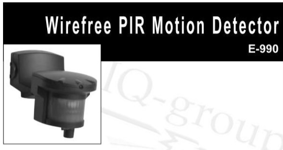

# Background

The picture below is of an IQ group wireless PIR sensor. Click on the image to show the PDF manual.

Unfortuntely, these PIR devices are no longer being made and over time, they do break down. The damage is usually caused from extreme weather (rain/moisture ingress) or maybe a forgotten battery has leaked acid etc. 

Once broken, these PIR sensors cannot easily be repaired, so if replacement sensors are unavailable, the associated IQ Group receiver can never trigger. 

Consider it is quite normal for different makes of wireless PIR sensor to send their own particular pattern of 433 MHz signal. This means that you can't usually pair a different make of PIR device with the IG group receiver - The 433 MHz pulse pattern from the PIR device is just not recognised as being a valid pattern that the receiver expects, and so it is ignored. Practically speaking, this is a real shame because the IQ group receiver device be can sited _outside_, which is a good thing to help RF signals being received from an _outside_ based PIR device. 

Sadly, there doesn't seem to be similar systems on the market today. More specifically, a system which has an _outside_ receiver that can switch mains electricity. 

You can still buy the IQ Group receiver devices cheaply from E8ay today. A few years back, I bought some brand new IQ Group receivers for £8 each (Bargain!). But of course, they are useless if you can't get the PIR sensors :(

In this repro, I have used a Friedland "NOVA" PIR device (shown below). I purchased these from Amaz0n recently for £8. If you wanted to, you could potentially adapt the code to work with any other make of PIR device - The code is reasonably documented 

# Purpose and system components
The purpose of the system for my scenario, is to enable the detection of movement to trigger a mains powered floodlight without the need for wired PIR devices.

The purpose of this repro is to enable the creation of a "433 MHz translator" device (or devices) that can receive and recognise specific 433 MHz signals (as transmitted by another make of wireless PIR sensors), and then transmit the specific 433 MHz signal that a IQ Group Receiver device can recognise. 

By enabling another make of Wireless PIR sensor device to be used, these IQ group receiver devices can be made to work again. Using this approach, I have saved myself from having to change my already installed IQ Group receiver, which for many years has worked really well for my general outside lighting needs. 

N.B. Also included in this repro, are 2 other programs that are useful if you want to use MQTT techniques instead.

The system is comprised of the following three components    

### Component 1 - IQ Group Receiver (Friedland)
This picture shows what an IQ Group receiver device looks like. When a recognised 433 MHz signal is received, it can switch mains power on/off via its own internal relay (e.g. to switch mains electricity to a floodlight)

### Component 2 - Wireless PIR devices
This picture shows what Friedland (NOVA) Wireless PIR devices look like. Note that the signal transmitted by one of these wireless PIR sensors isn't compatible with the signals expected by the IQ Group Receiver. This is why a "433 MHz translator" device is useful, such as implemented by a PICO W device programmed with this software connected to a cheap pair of 433 MHz RX and TX modules. 

### Component 3 -  "433 MHz translator" device
This picture shows the parts of the "433 MHz translator" device that need to be connected together - PICO W and cheap 433 MHz RX/TX modules   

# Description of program code   
There are 3 programs in this repro. The first is standalone, in that only one PICO W is needed to make the system work. 

The 2nd and 3rd programs (which have "MQTT" in the program name) need to be used together where one PICO W will be executing the "RX->MQTT" code while a second PICO W will be executing the "MQTT->TX" code. Admittedly, the addition of MQTT makes things a bit more complicated _(i.e. Instead of one "433 MHz translator" device, there are now 3 parts  - The "RX->MQTT" device(s), the "Home Assistant" MQTT server and the "MQTT->TX" device)_, but the MQTT approach does also open up more possiblities on how to control the IQ group receiver e.g. Via voice processing capability within "Home Assistant"? (but that is beyond the scope of this repro). 

The three programs are listed as below:
 - __PIR_RX_to_TX.ino__ ("RX->TX" device) -   This is for a combined 433 MHz RX and TX device as described above. As WiFi is NOT needed to make this device work, a "non WiFi" PICO can be used if you have one you want to use up. Consider that the RX and TX modules complete the signal path from PIR to IQ Group Receiver, with one PICO being needed. 
 - __PIR_RX_to_MQTT.ino__ ("RX->MQTT" device) - This is for a 433 MHz RX and MQTT sending (via WiFi network) device. Note that a PICO W is definately needed here, and only the RX module is used. I used this version with the MQTT server in "Home assistant" (running on a separate Raspberry Pi server in my network) so I could easily see a log of MQTT triggering in the "Home Assistant" MQTT logs.
 - __PIR_MQTT_to_TX.ino__ ("MQTT->TX" device) - This is for a MQTT listening device on your WiFi network that will transmit the required 433 MHz TX signal (via a TX module) to the IQ Group receiver when topic "PICO_433/TRIGGER/433MHZ" has been received from a MQTT server (e.g. like the MQTT server in "Home Assistant").  Note that a separate PICO W is needed here, and only the TX module is used. Note that if you are using the MQTT approach, then the "RX->TX" device is not required. 

# Helpful hints   
Please note the following: 
 - The Arduino IDE is used
 - The setup of the Arduino IDE for programming a PICO W is documented here https://randomnerdtutorials.com/programming-raspberry-pi-pico-w-arduino-ide/
 - This repro uses a Raspberry PICO W instead of an Arduino UNO, because when the two are compared, the PICO W is faster, smaller, cheaper and has Wifi capability
 - A pair of cheap 433mHz RX and TX modules is utilised (as pictured above).
 - An LDR and 10K resistor is used for Dark detection (if not used, the device will just work)
 - You can find setup info for the IQ Group receiver here  https://github.com/CurlyWurly-1/IQ-group-pir-wireless-arduino-TX

If you know how to sniff for 433 MHz signals, it should be reasonably easy to adapt this code to cater for other brands of wireless PIR sensors.

Have fun!
